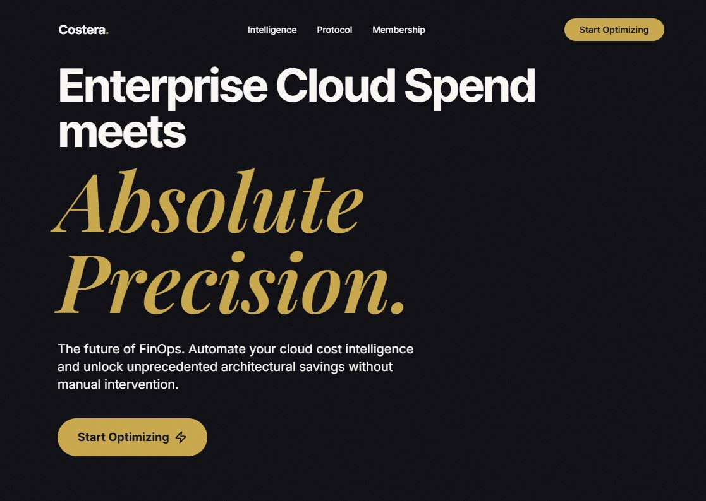

# Costera - FinOps Dashboard

 *(Preview of the landing page)*

🚀 **Live Demo:** [https://costera.netlify.app/](https://costera.netlify.app/)

Costera helps companies eliminate waste, optimize cloud spend, and turn infrastructure into a financial advantage.

---

## 🚀 Overview

Costera is a cloud FinOps platform designed to provide **visibility, control, and optimization** over cloud infrastructure costs.

Modern teams overspend on cloud services due to lack of insight and financial discipline. Costera bridges that gap by combining **cost monitoring, analytics, and actionable optimization strategies**.

---

## 🎯 Mission

To eliminate inefficient cloud spending and enforce financial discipline across modern tech stacks.

---

## 🌍 Vision

A world where every cloud dollar is accountable, optimized, and justified.

---

## 💻 Tech Stack

- **Framework:** React 19 + Vite
- **Styling:** Tailwind CSS v3.4.17
- **Animations:** GSAP 3 + ScrollTrigger
- **Icons:** Lucide React

---

## 🛠️ Getting Started

To run Costera locally, follow these steps:

1. **Clone the repository** (if applicable):
   ```bash
   git clone <repository-url>
   cd Costera
   ```

2. **Install dependencies:**
   ```bash
   npm install
   ```

3. **Start the development server:**
   ```bash
   npm run dev
   ```

4. **Open in browser:**
   Navigate to `http://localhost:5173/` (or the port specified by Vite).

---

## 📜 License

&copy; 2026 Costera Inc. All rights reserved.
